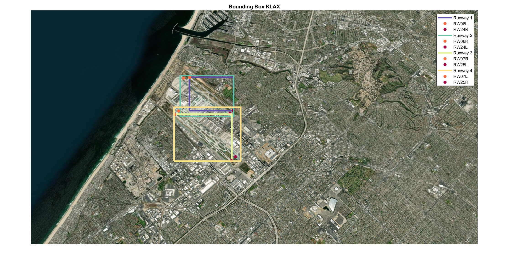
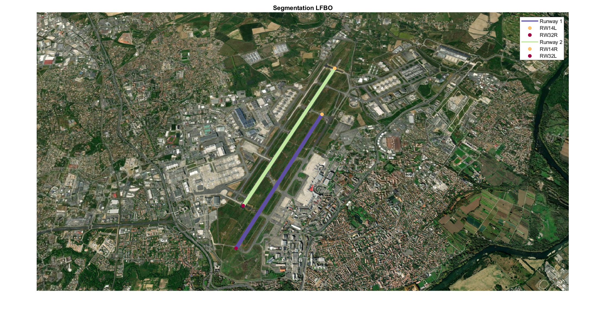

# Runway Detection System 
 - Synthetic dataset generation from satellite images with automatic labeling capabilities #[link](#dataset-generation)
 - Object detection and segmentaion with Mask R-CNN

## Dataset Generation 

### Walkthrough 
* Data processing *(TEMPLATE_DATA_PROCESSING)*
* Camera calibration *(TEMPLATE_CALIBRATION)*
* [OPTIONNAL] Interactive labeled image generation *(TEMPLATE_APP)*
* Dataset creation *(TEMPLATE_DATASET)*

## Runway Detection
